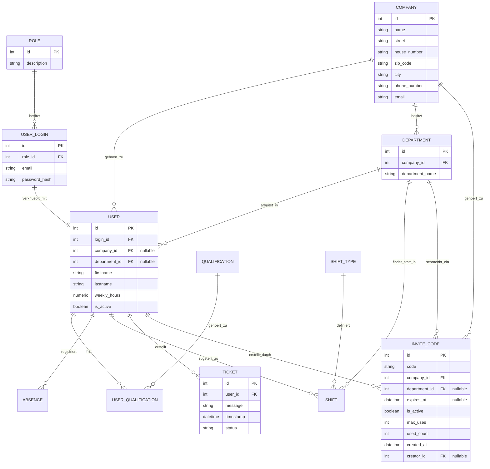

# 📅 Projektdokumentation: Dienstplan App

## 1. Problemstellung & Zielsetzung
In vielen Unternehmen und Abteilungen gestaltet sich die Dienstplanerstellung und -verwaltung nach wie vor ineffizient. Typische Probleme im operativen Alltag sind:

* **Hoher zeitlicher Aufwand:** Die manuelle Erstellung und Koordination von Schichten für Mitarbeiter bindet wertvolle Ressourcen und führt zu Überstunden oder Mehrarbeit in der Verwaltung.
* **Mangelnde Transparenz:** Mitarbeiter haben oft keine Live-Ansicht auf den aktuellen Plan, was Absprachen erschwert und die Zufriedenheit senkt.
* **Hohe Komplexität bei Ausfällen:** Fällt ein Mitarbeiter kurzfristig aus, ist es schwierig, schnell einen passenden Ersatz mit der richtigen Qualifikation und freien Kapazitäten zu finden.
* **Lange Reaktionszeiten:** Manuelle Kommunikationswege verlangsamen den Planungs- und Genehmigungsprozess erheblich.
* **Fehleranfälligkeit:** Ohne systemseitige Prüfungen kommt es leicht zu Konflikten, wie Doppelbelegungen, der Missachtung von Arbeitszeitgesetzen oder gesetzlich vorgeschriebenen Ruhepausen.

### Die Lösung
Eine **zentrale, datenbankgestützte Web-Anwendung** zur dynamischen Dienst- und Schichtplanung. Dieses Zeitmanagement-System soll Dienstpläne transparent machen, Planungskonflikte reduzieren und den Verwaltungsaufwand signifikant minimieren.

---

## 2. Anforderungen
Die Anwendung bietet eine intuitive Benutzeroberfläche (UI), mit der Abteilungsleiter Dienstpläne erstellen und verwalten können, während Mitarbeiter ihre Arbeitszeiten einsehen und Profildaten pflegen können.

### Funktionale Anforderungen
* **Mitarbeiterverwaltung:** Anlegen, Bearbeiten und Deaktivieren von Mitarbeitern sowie Zuordnung von vertraglichen Wochenstunden, Abteilungen und Qualifikationen.
* **Schichtplanung & Zuweisung:** Definition von Schichten (Datum, Uhrzeit von/bis, Abteilung, Schichtart) und Zuweisung zu qualifizierten Mitarbeitern sowie Kennzeichnung noch offener Schichten.
* **Abwesenheitsmanagement:** Erfassung und Statusverwaltung von Urlaub, Krankheitstagen und Weiterbildungen.
* **Qualifikationsabgleich:** Zuweisung spezieller Qualifikationen (z. B. Staplerschein, Ersthelfer), sodass nur qualifiziertes Personal für sicherheitsrelevante Schichten eingeteilt werden kann.
* **Profilverwaltung:** Benutzer können ihre eigenen Daten einsehen und grundlegende Informationen im Profil anpassen.

### Nicht-funktionale Anforderungen
* **Benutzerfreundlichkeit (Usability):** Eine übersichtliche, responsive grafische Oberfläche, die ohne lange Einarbeitungszeit bedient werden kann.
* **Datenkonsistenz & Validierung:** Vermeidung von Planungskonflikten (z. B. keine Einteilung eines Mitarbeiters während einer genehmigten Abwesenheit).
* **Performance:** Schnelle Ladezeiten beim Wechseln zwischen Kalenderwochen und beim Filtern von Abteilungen.
* **Erweiterbarkeit & Wartbarkeit:** Modularer Aufbau des Codes zur einfachen Integration neuer Features.

---

## 3. Planung & Lösungskonzept

### Technologie-Stack
* **Programmiersprache: Python**
  * *Begründung:* Python bietet eine hervorragende Balance aus Lesbarkeit, Entwicklungsgeschwindigkeit und einer breiten Auswahl an Bibliotheken.
* **Web-Framework: Flask**
  * *Begründung:* Flask ist ein extrem leichtgewichtiges WSGI-Web-Framework, das maximale Flexibilität bei der Strukturierung der Applikation ermöglicht (Application Factory Pattern, Blueprints).
* **Datenbank: MariaDB / MySQL mit SQLAlchemy (ORM) und Flask-Migrate**
  * *Begründung:* SQLAlchemy abstrahiert SQL-Queries und schützt vor SQL-Injektionen. Flask-Migrate (Alembic) ermöglicht eine versionierte Evolution des Datenbankschemas.

---

## 4. Technische Architektur & Code-Struktur
Das Projekt folgt dem **Model-View-Controller (MVC)**-Muster und kapselt Logik sauber über Flask Blueprints und Services.

### Verzeichnisstruktur
```text
dienstplan_app_GUI_projekt/
│
├── DienstplanApp/
│   ├── models/            # SQLAlchemy-Datenbankmodelle
│   │   ├── absence.py
│   │   ├── company.py
│   │   ├── department.py
│   │   ├── invite_code.py
│   │   ├── qualification.py
│   │   ├── role.py
│   │   ├── shift.py
│   │   ├── shift_type.py
│   │   ├── ticket.py
│   │   ├── user.py
│   │   ├── user_login.py
│   │   └── user_qualification.py
│   │
│   ├── routes/            # Flask Blueprints (Controller-Logik)
│   │   ├── absence_bp.py
│   │   ├── auth_bp.py     # Login & Registrierung
│   │   ├── company_bp.py
│   │   ├── employee_bp.py
│   │   ├── info_bp.py
│   │   ├── profile_bp.py  # Profil-Ansicht & Bearbeitung
│   │   ├── qualification_bp.py
│   │   ├── role_bp.py
│   │   └── shift_bp.py
│   │
│   ├── services/          # Wiederverwendbare Geschäftslogik
│   │   └── validate.py    # E-Mail- und Passwortvalidierung
│   │
│   ├── templates/         # Jinja2-HTML-Templates (Views)
│   │   ├── absence/
│   │   ├── auth/
│   │   ├── company/
│   │   ├── info/
│   │   ├── qualification/
│   │   ├── role/
│   │   ├── shift/
│   │   ├── base.html
│   │   ├── index.html
│   │   └── profile.html
│   │
│   ├── static/            # Statische Assets (CSS, JS, Bilder)
│   │   └── css/style.css
│   │
│   ├── __init__.py        # Application Factory (create_app)
│   ├── config.py          # Konfigurationsparameter (DB-Pool, Keys)
│   ├── decorators.py      # Custom Decorators (z.B. admin_required)
│   ├── extensions.py      # Initialisierung von DB, Migrate, LoginManager
│   └── seed.py            # Datenbank-Seeding für Testdaten
│
├── migrations/            # Datenbank-Migrationsdateien (Flask-Migrate)
├── Doku/
│   ├── doku.md            # Diese Projektdokumentation
│   └── features_tastenspieler.md
└── .gitignore
```

### Datenbankschema (ER-Modell)
Die Beziehungen zwischen den Kerntabellen sind wie folgt aufgebaut:



### Sicherheitskonzepte
1. **Passwort-Hashing:** Passwörter werden niemals im Klartext gespeichert. Die Absicherung erfolgt via `werkzeug.security` unter Verwendung von starken, gesalzenen Krypto-Hashes.
2. **CSRF-Schutz:** Jedes Formular wird mithilfe von `Flask-WTF` bzw. `CSRFProtect` gegen Cross-Site Request Forgery geschützt.
3. **Limiter (Rate Limiting):** Zum Schutz vor Brute-Force-Angriffen auf kritische Endpunkte (wie Login/Registrierung) ist `Flask-Limiter` aktiv.
4. **Validierungs-Service:** E-Mail-Formate sowie Passwort-Komplexitätsregeln (Länge, Sonderzeichen, Groß-/Kleinschreibung) sind zentral in `services/validate.py` definiert.